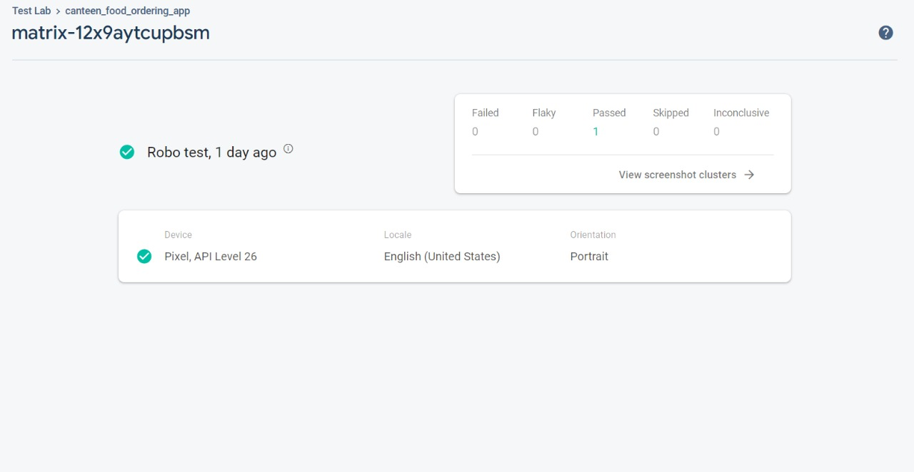

# foodKamp (A Food Ordering App)

In this era where time is money, people in our college generally face the hassle of waiting
a lot in cafeterias like Cafe Zippy and Aladin to get their food. It is a tiring and time-
consuming process. But a food ordering app can reduce this time barrier. With the
help of this system, a person can order desired food at his desired time. Also, it will
help restaurants to get optimized control, as they will be well prepared with the orders,
when the customer arrives. From the management point of view, the manager will be
able to control the restaurant by having all the reports in hand and will be able to see
the records of their sales. This application helps the restaurants to do all functionalities
accurately and also increase their efficiency. Thus, benefiting everyone involved in the
business.

## Architecture

## User App Interface

### Signup & Login

By tapping on 'Explore', user can enter the app. First user will be directed to the
'Login' page. And then from there, user can select 'Sign Up' option, to go to 'Sign Up'
page and get registered. User can register by filling all the required details. After all fields are filled, user can tap on 'Sign Up' button. Then, a verification link will sent to user's e-mail ID. When
user will click on that link, user registration will be completed. After the user is registered, user can login using their e-mail ID and password.

### User Home Page & Profile Section

The home page contains the list of restaurants that are registered on the app, from
where the user can order food. Name, category, opening time, and closing time is displayed for each restaurant. User profile contains all the user details, wallet balance, option to add money and edit profile. Also, terms and conditions and app information can also be seen from the profile
section. The user can sign out of the app from the button at the top-right corner of the
profile page.

### Wallet & Payment

User can add any amount of money to their wallet through their desired payment method.

### Placing an Order

User can add items to their cart and further, increase or decrease the quantities of items in the cart. User also has to select the pick-up, taking in account of the preparation time too. After that, user can tap on 'Proceed to Buy' button. After the user clicks on 'Proceed to Buy', a pop-up opens up asking for order confirmation. It displays total items and total amount. To confirm the order, user must tap on 'Place Order' button. Once the user confirms the order, the user will be directed to the order history page, which shows the recent order on top. Once the user taps on the recent order, order details of that recent order will be displayed on the screen. The order details will contain restaurant name on top, QR code for user verification, at time of order pick-up, items, total amount, order status, and reaching/pick-up time.

### Receiving an Order

Also, if scanning doesn't work for any reason, the user can manually tap on the 'Received' button to complete the order pick-up.

## Restaurant App Interface

### Login & Signup

By tapping on 'Explore', restaurant user can enter the app. First user will be directed to the 'Login' page. And then from there, user can select 'Sign Up' option, to go to'Sign Up' page and get registered. Restaurant user can register by filling all the required details. After all fields are filled, user can tap on 'Sign Up' button. Then, a verification link will sent to the given e-mail ID. When restaurant user will click on that link, restaurant registration will be completed. After the user is registered, user can login using their e-mail ID and password.

### Restaurant Home Page & Menu Bar

The restaurant can get information about all the orders placed to their restaurant, and can prepare accordingly. The menu bar contains options to edit profile, visit menu, see delivered orders, etc. The restaurant can edit their profile, i.e., they can update their category, opening time and closing time. The delivered orders section contains two pages, one for the delivered orders, and other for the expired orders (not picked-up).

### Restaurant Menu

Menu contains list of all the items available at the restaurant. Item price, quantity left, and preparation time is visible. To add an item, restaurant user has to tap on the '+' icon at the bottom. A pop-up will appear, where the user can enter the required details. After filling all the details, restaurant user must tap on 'Add item' to save the item. After that item will be visible in the updated menu. Also, items can be updated by just tapping on the item. A pop-up will open, containing the current details of item, which can be updated. After, filling the updated details, restaurant user must tap on 'Edit item' to save the details. After that the item will be updated in the menu. Also, there quick edit options for the menu, which allow emptying the item, i.e., changing the quantity to 0, and deleting the item from the menu. The quick edit menu appears for each item when we continue to hold on the item for some time. Once, we tap on the 'Empty item' option, the quantity available of the item will be instantly changed to 0. As we can see that the quantity of item 'poha' changed from 25 to 0. The 'Delete Item' option works in the same way, once we tap on that, the item will be instantly deleted.

### Giving Order to the customer

Once, the order is prepared, and the customer has arrived for the order pick-up, the restaurant can scan the QR code from customer's phone. And when the QR code is scanned successfully, order will be completed. Here first we had the order details page, when the order is not completed. Then restaurant can open the QR scanner from the button present at the bottom of screen in the 'Pending Orders' page. After the scan is completed, the order details page will update and now the status show will be delivered.

## Tools Used

1. Framework - Flutter
2. Language - Dart
3. Database - Firebase Firestore
4. Payment Gateway - Razor Pay

## Building & Deploying the App

1. Clone or download this repository.
2. Open the folder in any IDE, VS Code is preferred.
3. Open the 'foodKamp - restaurant side' folder for user side app code.
4. Open the 'foodKamp - user side' folder for restaurant side app code.
5. Install all the dependencies using pub get.
6. Connect an android device with debugging turned on or an emulator.
7. Build and Run the application.
8. Once it is successfully built and installed, enjoy using it!
9. For more information about deploying the app, <a href="https://flutter.dev/docs/deployment/android#building-the-app-for-release">Click Here!</a>

## Testing the Code

1. Test files for each app is present in the 'test' directory, inside the respective code folders.
2. Tests can be run from any IDE, or command line. VS Code is again preferred for easy interaction
3. For VS Code, open the test file, click on 'Run, and then click on 'Start Debugging'.
4. For command line, run command "flutter test test/test_file_name.dart" inside the project folder
5. Here is an image for the successful run of tests 
6. Here is an image for the successful run of firebase performance testing. 
7. For more information about testing, <a href="https://flutter.dev/docs/cookbook/testing/unit/introduction">Click Here!</a>
